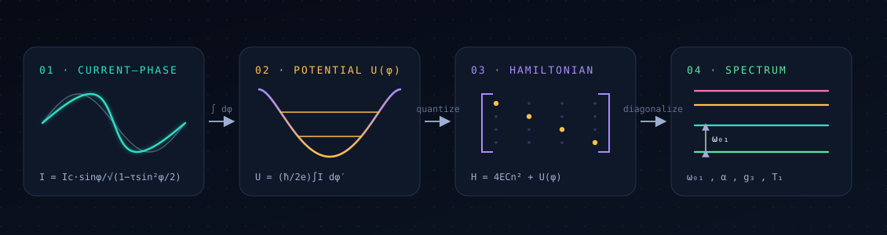
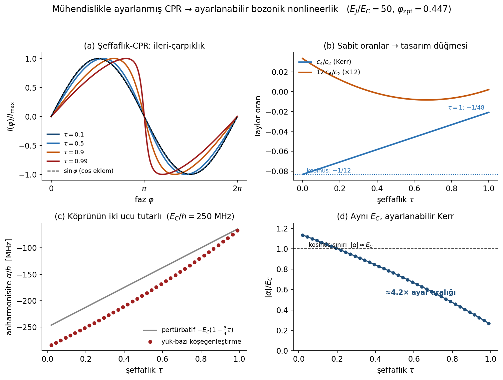
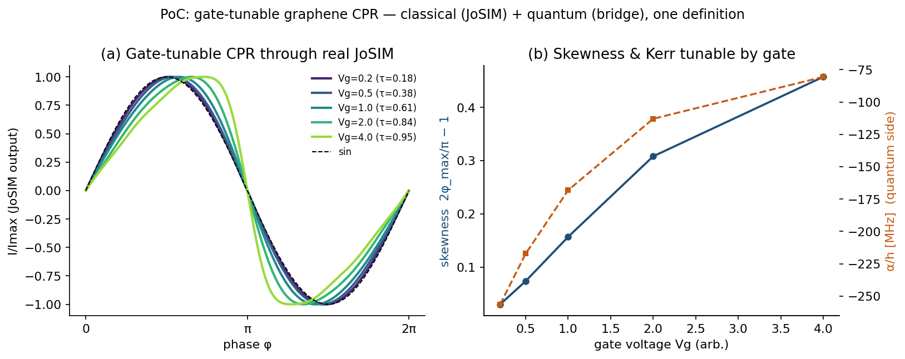
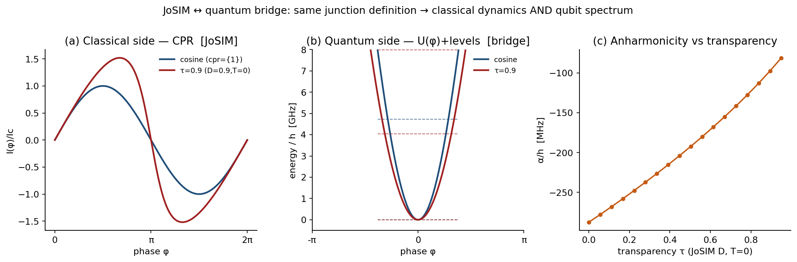
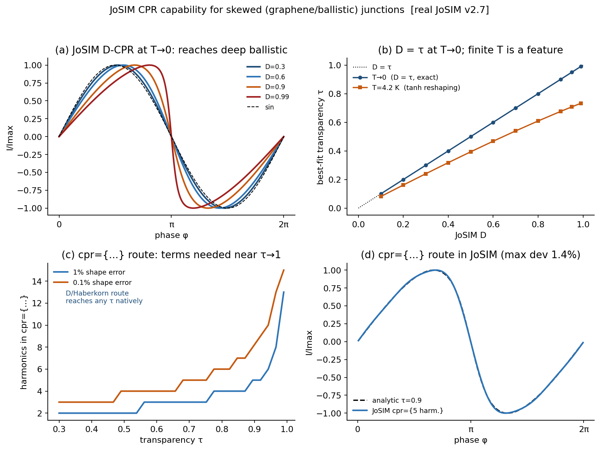

<div align="center">



<br/>

[](LICENSE)
[](https://www.python.org/)
[](requirements.txt)
[](validation/test_physics.py)
[](josim_tools/tests/run_tests.py)
[](https://github.com/FarukSamiBilgin/josim-cpr-bridge/actions/workflows/ci.yml)
[](https://codespaces.new/FarukSamiBilgin/josim-cpr-bridge)

**[Getting started](docs/GETTING_STARTED.md)** &nbsp;·&nbsp;
**[Theory](docs/THEORY.md)** &nbsp;·&nbsp;
**[Architecture](docs/ARCHITECTURE.md)** &nbsp;·&nbsp;
**[Validation](#-validation)** &nbsp;·&nbsp;
**[Roadmap](#-roadmap)**

</div>

---

> **One junction definition, two solvers.** The same exotic‑junction current–phase relation (CPR) that JoSIM simulates *classically* is carried — provably unchanged — to the *quantum* side: level spectrum, anharmonicity / Kerr, three‑wave mixing, and a T₁ estimate. It speaks JoSIM's own CPR language, so the classical and quantum descriptions are the **same element**, not two models that happen to look alike.

<br/>

## ⚡ Overview

Mature circuit‑quantization tools — [scQubits](https://scqubits.readthedocs.io), [SQcircuit](https://sqcircuit.org), [CircuitQ](https://circuitq.readthedocs.io) — assume a **cosine** Josephson potential. Non‑conventional weak links (graphene, twisted bilayer graphene, Dirac, high‑transparency point contacts) have a **non‑sinusoidal, forward‑skewed CPR**, and that skew changes the qubit frequency *and* its anharmonicity. An arbitrary CPR is simply not a first‑class input to those tools.

`josim-cpr-bridge` fills exactly that gap. It mirrors JoSIM's supercurrent conventions on one side, and on the other turns any CPR into a Josephson potential, a qubit Hamiltonian, and a spectrum — keeping the two ends consistent to numerical precision.

<div align="center">

</div>

<br/>

## 🔭 Why this exists

A Josephson junction's stored energy is the integral of its CPR, `U(φ) = (ħ/2e) ∫ I(φ′) dφ′`. For the textbook `I = Ic sin φ` this is the cosine well every quantization tool assumes. A **skewed** CPR adds higher harmonics to that well, which shifts the curvature at the bottom (the qubit frequency `ω₀₁`) and the quartic term (the anharmonicity `α`). In other words:

> A non‑conventional CPR turns the qubit's frequency and anharmonicity into **design parameters** — tunable by gate voltage and temperature, exactly what graphene / TBG junctions offer.

That is a real, narrow gap between a classical superconducting‑circuit simulator and the quantum‑spectrum tools — and it is what this package targets.

<br/>

## 🧭 How it works

<div align="center">

</div>

| Stage | What happens | In the code |
|:--|:--|:--|
| **1 · CPR** | the current–phase relation: harmonic `cpr={…}`, transparency `D`, or a tabulated curve | `cpr_current(...)` mirrors JoSIM exactly |
| **2 · Potential** | integrate to the Josephson well `U(φ) = (ħ/2e) ∫ I dφ′` | `potential_U(...)` |
| **3 · Hamiltonian** | build `H = 4 E_C n² + U(φ)` in the charge basis | `spectrum(...)` |
| **4 · Spectrum** | diagonalize → `ω₀₁`, `α` (Kerr), `g₃`, matrix elements, `T₁` | `qubit_params`, `taylor_coeffs`, `t1_estimate` |

> The quantum spectrum is computed **outside** JoSIM, by design. JoSIM solves the classical RCSJ dynamics; spectra belong to the quantization tools. The contribution is the consistent, arbitrary‑CPR *bridge* between them. See [**Architecture**](docs/ARCHITECTURE.md) for the full rationale.

<br/>

## 🚀 Quick start

```bash
git clone https://github.com/FarukSamiBilgin/josim-cpr-bridge.git
cd josim-cpr-bridge
pip install -r requirements.txt        # one dependency: numpy
python validation/test_physics.py      # 7/7 physics checks should pass
```

Thirty seconds of the bridge:

```python
import josim_bridge as jb

EC, EJ = 0.25, 12.5                       # GHz — transmon regime (E_J / E_C = 50)

jb.qubit_params(EC, EJ, cpr=(1.0,))       # cosine baseline      ->  (ω₀₁, α)
jb.qubit_params(EC, EJ, D=0.9, T=0)       # τ = 0.9 transparency CPR
jb.taylor_coeffs(D=0.9, T=0)              # c₂, c₃ (three-wave), c₄ (Kerr)
jb.t1_estimate(EC, EJ, D=0.9, T=0, tan_delta=1e-6)   # dielectric-loss T₁
```

New here? The [**0‑to‑100 getting‑started guide**](docs/GETTING_STARTED.md) walks through every tool with copy‑paste commands and expected output.

<br/>

## 🧰 What's inside

```
josim-cpr-bridge/
├── josim_bridge.py              ← the bridge: CPR → U(φ) → H → spectrum  (pure numpy)
├── josim_decks/
│   └── cpr_tracer.cir           ← JoSIM deck that traces I(φ) for sin / D / harmonic CPR
├── josim_tools/                 ← JoSIM-side tooling — no core changes, works with stock JoSIM
│   ├── cpr_to_josim.py          ← fit any measured / DFT CPR → JoSIM cpr={…} card
│   ├── graphene_cpr.py          ← gate-tunable graphene reference: τ(V_g), I_c(V_g) → card
│   ├── exotic_junctions.lib     ← .include library: graphene / SNS / Dirac, π, φ₀ junctions
│   ├── PATCH_SKELETON.md        ← C++ design for native cprtype=graphene/table (no Jacobian)
│   └── tests/run_tests.py       ← regression vs josim-cli  (5/5 on v2.7)
├── validation/
│   ├── test_physics.py          ← physics checks: independent solver + analytic limits
│   └── run_all.py               ← reproduces the validation table
└── figures/                     ← the figures below
```

| File | Role |
|:--|:--|
| [`josim_bridge.py`](josim_bridge.py) | The bridge. `cpr_current`, `potential_U`, `spectrum`, `qubit_params`, `taylor_coeffs`, `charge_mat_elem`, `t1_estimate`. |
| [`josim_tools/cpr_to_josim.py`](josim_tools/cpr_to_josim.py) | Turns an arbitrary CPR curve into the `cpr={…}` harmonic vector JoSIM consumes, and reports the harmonic count for a target shape accuracy. |
| [`josim_tools/graphene_cpr.py`](josim_tools/graphene_cpr.py) | Phenomenological gate maps `τ(V_g)`, `I_c(V_g)` → a ready JoSIM model card; the reference for the proposed C++ path. |
| [`josim_tools/exotic_junctions.lib`](josim_tools/exotic_junctions.lib) | Drop‑in `.include` library of non‑conventional weak links — both routes (harmonic & native `D`), plus π‑ and φ₀‑junctions. |
| [`josim_tools/PATCH_SKELETON.md`](josim_tools/PATCH_SKELETON.md) | Scoped C++ design for a native `cprtype=graphene/table` selector in JoSIM. |

<br/>

## 🔬 Validation

Two independent layers — both fully reproducible.

**1 · Against the real `josim-cli` v2.7 binary** &nbsp;(`josim_tools/tests/run_tests.py`)

| Check (traced on JoSIM v2.7) | Expectation | Result |
|:--|:--|:--|
| `D=0` | `sin φ` | max dev **4.7 × 10⁻⁷** |
| `D=0.8`, `T → 0` | transparency `τ = 0.8` | max dev **7.8 × 10⁻⁷** |
| `cpr={…}` 4‑harmonic vs `τ = 0.8` | forward‑skewed shape | max dev **8.5 × 10⁻³** |
| `PHI=π` | `−sin φ` | peak at `φ = 3π/2` |
| `cpr={…}`, `τ = 0.95` | forward‑skewed | peak at `φ = 2.27 > π/2` |

→ **5 / 5 pass on JoSIM v2.7.**

**2 · Physics of the bridge** &nbsp;(`validation/test_physics.py`, pure numpy)

| Check | Result |
|:--|:--|
| Two independent eigensolvers agree (cosine) | `ω₀₁ = 4.7355 GHz`, `α = −287.3 MHz` |
| Two independent eigensolvers agree (`τ = 0.9`) | `ω₀₁ = 4.0419 GHz`, `α = −96.0 MHz` |
| Kerr ratio `c₄/c₂ = τ/16 − 1/12` vs symbolic | matched to **5.7 × 10⁻⁶** |
| π‑shift leaves the spectrum invariant | **1.8 × 10⁻¹³** |
| `D → 0` reduces to the cosine junction | **0.000 MHz** |

→ **7 / 7 pass** &nbsp;(`charge basis` vs `phase‑basis finite difference` — two different solvers, same answer).

> **The headline result.** For a cosine junction the ratio `c₄/c₂` (Kerr‑per‑unit‑frequency) is *locked* at `−1/12`. With a skewed CPR it becomes `τ/16 − 1/12` — a **design knob**: anharmonicity is tunable ~3× at fixed `E_C`, while `T₁` modestly *improves* with transparency as the matrix element `|⟨0|n|1⟩|²` drops.

### Gallery

<div align="center">

| Engineered CPR → tunable Kerr | Gate‑tunable graphene CPR |
|:--:|:--:|
|  |  |
| **JoSIM ↔ bridge demonstration** | **Stage‑1 gap analysis** |
|  |  |

</div>

<br/>

## 📐 The physics, in one screen

A junction's CPR sets its potential, and the potential sets the qubit:

```
   I(φ) ──►  U(φ) = (ħ/2e) ∫ I(φ′) dφ′  ──►  H = 4 E_C n² + U(φ)  ──►  ω₀₁ , α , g₃ , T₁
```

Two CPR parametrizations cover the cases of interest:

- **Harmonic** — `I = Ic · Σ cₙ sin(nφ)`; a forward skew is a few extra sine harmonics.
- **Transparency (short‑ballistic)** — `I = Ic · sin φ / √(1 − τ sin²(φ/2))`, with channel transparency `τ ∈ (0, 1]`. As `τ → 1` the CPR approaches a sawtooth.

Integrating either gives a well with extra cosine harmonics; in the transmon regime its curvature fixes `ω₀₁ ≈ √(8 E_J E_C) − E_C` and its quartic term fixes `α ≈ −E_C` — both of which move once the CPR is skewed. The full derivation, including the `c₄/c₂ = τ/16 − 1/12` result, is in [**`docs/THEORY.md`**](docs/THEORY.md).

<br/>

## 🗺️ Roadmap

The natural next step is a **native** generalized CPR inside JoSIM, designed to be **additive and non‑breaking**:

- A single new model selector `cprtype` with three values — `harmonic` (today's default), `graphene` (a named, temperature‑independent transparency CPR), and `table` (a measured / DFT curve).
- The CPR stays on the RHS via the predicted phase `φ₀` — **no `dI/dφ` Jacobian**, and the LU‑refactorization logic is untouched.
- Every existing deck traces **bit‑identically**, guarded by regression tests.

A scoped C++ design lives in [`josim_tools/PATCH_SKELETON.md`](josim_tools/PATCH_SKELETON.md).

<details>
<summary><b>A useful finding from reading the JoSIM v2.7 source</b></summary>

<br/>

JoSIM's temperature‑dependent **Haberkorn** branch (switched on by `D`) already evaluates the short‑ballistic transparency CPR, and at `T → 0` it reduces *exactly* to the Beenakker form with `τ = D` — i.e. the canonical graphene / Dirac CPR is **already representable natively** (verified on the v2.7 binary to ~10⁻⁷). That narrows the contribution, in a good way, to a *named, temperature‑independent* transparency CPR plus a tabulated route — rather than "arbitrary CPR from scratch."

</details>

Planned validation against published data: digitize a measured ballistic‑graphene CPR (Nanda *et al.* 2017, or an SNS reference such as English *et al.* 2016), fit `τ(V_g)`, and reproduce the reported skewness‑vs‑gate trend.

<br/>

## 🤝 Contributing

Contributions, issues, and discussion are welcome — see [**`CONTRIBUTING.md`**](CONTRIBUTING.md) and the [**code of conduct**](CODE_OF_CONDUCT.md). The short version: keep the two ends of the bridge consistent (any change to the classical mirror must keep the physics tests passing), and run `python validation/test_physics.py` before opening a PR.

<br/>

## 📚 Citation

If this work is useful in your research, please cite it — GitHub's **“Cite this repository”** button reads [`CITATION.cff`](CITATION.cff). BibTeX:

```bibtex
@software{bilgin_josim_cpr_bridge,
  author  = {Bilgin, Faruk Sami},
  title   = {josim-cpr-bridge: a classical-to-quantum current-phase-relation bridge for exotic Josephson junctions},
  year    = {2026},
  url      = {https://github.com/FarukSamiBilgin/josim-cpr-bridge},
  license  = {MIT}
}
```

<br/>

## 🙏 Acknowledgements

Built as the quantum‑side companion to **[JoSIM](https://github.com/JoeyDelp/JoSIM)** — the superconducting‑circuit simulator by Johannes Delport, Coenrad Fourie, Kyle Jackman, and Paul le Roux (Stellenbosch University). The transparency CPR rests on Haberkorn *et al.* (1978) and Beenakker (1991); the gate‑tunable graphene picture on Nanda *et al.* (2017) and English *et al.* (2016). Full references are in [`docs/THEORY.md`](docs/THEORY.md).

<br/>

## 📄 License

[MIT](LICENSE) © 2026 Faruk Sami Bilgin.

<div align="center">
<br/>
<sub>One junction · two solvers · the same physics on both sides.</sub>
</div>
