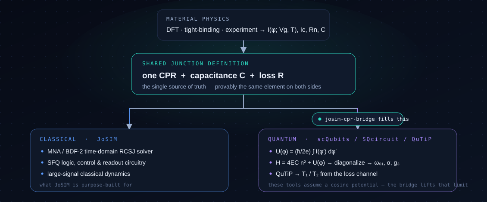
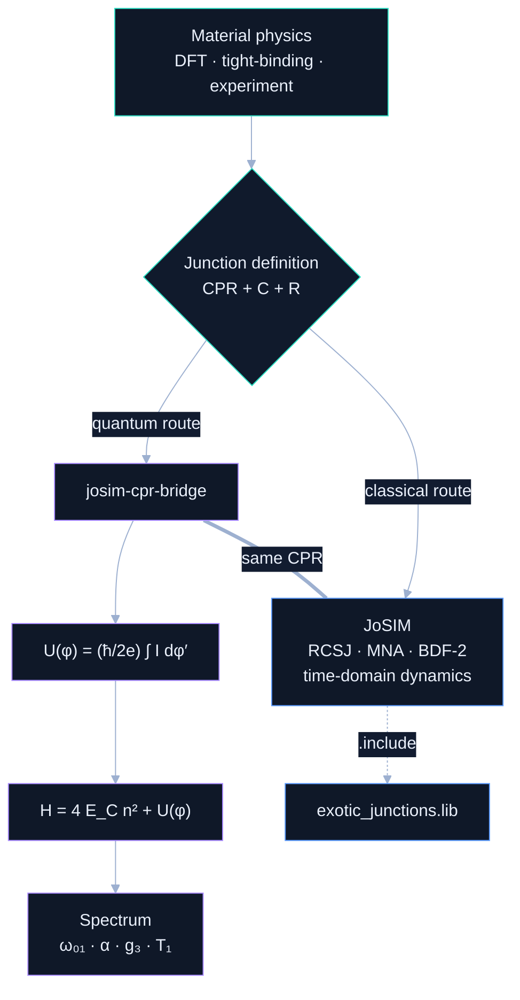
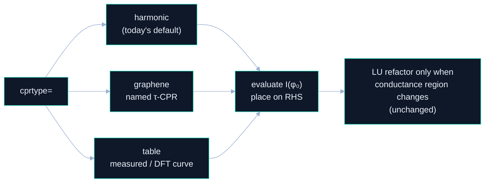

# Architecture — one model, two solvers

This document explains the single design decision the whole project rests on: the
junction is defined **once**, and that one definition is consumed by **two** different
mathematical engines — JoSIM's classical time‑domain solver, and a quantum
eigen‑solver. The bridge's job is to keep those two ends provably consistent.

---

## 1. The data flow

The thick link is the invariant the tests guard: the CPR that JoSIM integrates in time
and the CPR the bridge integrates into a potential are the **same function**, to
numerical precision.

---

## 2. Why the quantum solver lives *outside* JoSIM

This is a deliberate choice, not a shortcut. The two routes are **mathematically
orthogonal**:

| | Classical (JoSIM) | Quantum (bridge → eigen‑tools) |
|:--|:--|:--|
| Problem type | initial‑value ODE/DAE in time | static Hermitian eigenproblem |
| Kernel | modified nodal analysis + BDF‑2 integration | diagonalize a banded Hamiltonian |
| Question answered | large‑signal classical dynamics, SFQ logic, control | energy levels, anharmonicity, mixing, coherence |
| State | node voltages & branch currents vs time | $\lvert\psi\rangle$ in the charge basis |

They **share the device definition** but not the solver. Embedding a Hermitian
eigen‑solver inside a SPICE‑class transient simulator would duplicate mature, validated
tools ([scQubits](https://scqubits.readthedocs.io), [SQcircuit](https://sqcircuit.org),
[QuTiP](https://qutip.org)) inside a program built for a different question — more
surface area, less trust, no new capability.

> **The actually‑missing piece** is not another eigen‑solver; it is a *consistent CPR
> bridge* between the classical and quantum descriptions of a non‑conventional junction.
> That is this repository. On the JoSIM side, the complementary contribution is a
> **native generalized CPR** (next section) — kept strictly on the classical solver
> where it belongs.

---

## 3. Module responsibilities

| Module | Owns | Does **not** do |
|:--|:--|:--|
| [`josim_bridge.py`](../josim_bridge.py) | CPR → potential → Hamiltonian → spectrum; the classical‑mirror that reproduces JoSIM's supercurrent | run a circuit; talk to `josim-cli` |
| [`josim_tools/cpr_to_josim.py`](../josim_tools/cpr_to_josim.py) | fit an arbitrary CPR to the `cpr={…}` vector; pick harmonic count for a target accuracy | quantization |
| [`josim_tools/graphene_cpr.py`](../josim_tools/graphene_cpr.py) | phenomenological $\tau(V_g)$, $I_c(V_g)$ → JoSIM card | claim to be a microscopic model |
| [`josim_tools/exotic_junctions.lib`](../josim_tools/exotic_junctions.lib) | ready `.include` models for both routes | depend on any patch |
| [`josim_decks/cpr_tracer.cir`](../josim_decks/cpr_tracer.cir) | trace $I(\varphi)$ through the real simulator | quantization |
| [`validation/`](../validation/) | physics checks (independent solver, analytic limits) + JoSIM‑binary regression | — |

Each piece has one job; the bridge never reaches into JoSIM's internals, and the JoSIM
tooling never depends on the quantum side.

---

## 4. The JoSIM‑side approach: additive, non‑breaking

Two layers, in order of invasiveness:

**(a) Zero‑change layer — works on stock JoSIM today.** Any skewed CPR is expressed
through the existing `cpr={…}` harmonic input (via `cpr_to_josim.py`) or the existing
transparency branch (`D`, `T`). Nothing in JoSIM is touched; `exotic_junctions.lib` is a
plain `.include`.

**(b) Proposed native layer — a scoped C++ extension.** A single new model selector
`cprtype` with three values, designed so existing decks are **bit‑identical**:

The critical design constraints, taken from reading the v2.7 source and spelled out in
[`josim_tools/PATCH_SKELETON.md`](../josim_tools/PATCH_SKELETON.md):

- The generalized CPR is evaluated at the **predicted phase $\varphi_0$** and placed on
  the right‑hand side — exactly how JoSIM already handles its Josephson current.
- **No $dI/d\varphi$ Jacobian linearization** is introduced; the existing solver structure
  is preserved.
- **LU refactorization** still happens only when a junction's voltage‑region conductance
  changes — that logic is untouched.
- Every existing deck must trace bit‑identically, guarded by regression tests.

---

## 5. Design trade‑offs

| Choice | Why | Cost we accept |
|:--|:--|:--|
| Pure‑NumPy bridge, no SciPy/Matplotlib | trivial install, easy to audit, runs in CI in seconds | we hand‑roll the small linear algebra |
| Charge basis for the Hamiltonian | banded & exact for harmonic + transparency CPRs | very large $E_J/E_C$ needs more charge states |
| Two CPR parametrizations (harmonic + transparency) | covers graphene/Dirac and arbitrary measured curves | a pathological CPR may need many harmonics |
| Quantum solver outside JoSIM | reuses validated tools; clean separation | two artifacts to keep consistent (the tests do this) |

---

## 6. Out of scope (on purpose)

To keep the contribution honest and reviewable, the following are **not** claimed here:

- A microscopic, materials‑accurate model of any specific device — the graphene maps are
  phenomenological references, clearly labelled as such.
- Self‑consistent electromagnetic or multi‑junction circuit *quantization* — the bridge
  treats a single junction mode.
- Replacing scQubits / SQcircuit / QuTiP — the bridge complements them by supplying the
  one input they lack (an arbitrary CPR).
- Time‑domain quantum dynamics inside JoSIM — JoSIM stays classical by design.

For the physics behind every formula above, see [`THEORY.md`](THEORY.md).
